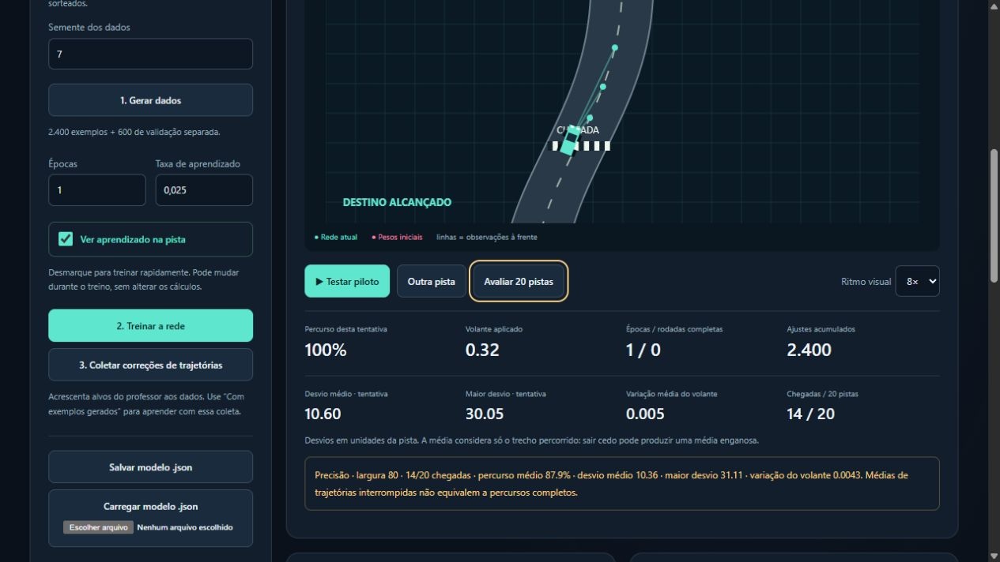

# Estrada Neural — versão 2

**Veja uma rede neural aprender a dirigir, acompanhe seus primeiros ajustes e salve o aprendizado em um arquivo JSON.**

Estrada Neural é um laboratório educativo em **JavaScript puro, HTML e CSS**, sem bibliotecas externas. O projeto mostra o ciclo de uma pequena inteligência artificial: geração de dados, criação de parâmetros, previsão, cálculo de erro, retropropagação, treinamento, avaliação e persistência do modelo.

A tarefa é levar um carro ao final de uma estrada com curvas sem sair da pista. A versão 2 permite **ver o aprendizado na tela ou treinar rapidamente sem animação**, com resultados matematicamente idênticos para a mesma configuração e sequência de ações.

> **Autoria:** todo o código deste projeto foi criado pelo **Codex, assistente de inteligência artificial da OpenAI**, a partir da proposta e das orientações do idealizador humano. Isso inclui o simulador, a rede, a matemática do treinamento, a interface, os testes e as melhorias desta versão. A documentação também foi elaborada pelo assistente. O aplicativo usa sua própria pequena rede localmente e não consulta o Codex ou uma API de IA durante o uso. Veja [AUTHORS.md](AUTHORS.md).



## Sumário

- [1. O que mudou e o que você vai aprender](#1-o-que-mudou-e-o-que-você-vai-aprender)
- [2. Como abrir o projeto](#2-como-abrir-o-projeto)
- [3. Experimentos guiados](#3-experimentos-guiados)
- [4. Todos os botões e controles](#4-todos-os-botões-e-controles)
- [5. Como interpretar a tela](#5-como-interpretar-a-tela)
- [6. O processo completo, explicado do zero](#6-o-processo-completo-explicado-do-zero)
- [7. O modelo em arquivo JSON](#7-o-modelo-em-arquivo-json)
- [8. Como os dados são separados](#8-como-os-dados-são-separados)
- [9. Resultados e testes](#9-resultados-e-testes)
- [10. Mapa dos arquivos e funções](#10-mapa-dos-arquivos-e-funções)
- [11. Experimentos para aprender mais](#11-experimentos-para-aprender-mais)
- [12. Perguntas frequentes](#12-perguntas-frequentes)
- [13. Limites da demonstração](#13-limites-da-demonstração)
- [14. Glossário sem complicação](#14-glossário-sem-complicação)
- [15. Publicação e créditos](#15-publicação-e-créditos)

## 1. O que mudou e o que você vai aprender

Na primeira versão, o treino era tão rápido que o carro parecia passar de “não sabe” para “já aprendeu” instantaneamente. Uma época já continha **2.400 atualizações**, e o teste de chegar ao final de uma pista larga era pouco exigente.

A versão 2 torna esse processo observável:

- opção **Ver aprendizado na pista**, que pode ser alterada durante o treinamento;
- prévias desde **25 ajustes**, antes de completar a primeira época;
- método adicional **Enquanto dirige · com professor**, com atualizações durante as trajetórias;
- desafio **Precisão**, com pista de 80 unidades de largura, além da pista original de 120;
- métricas de desvio do centro e variação do volante;
- interrupção e retomada no próximo exemplo ou decisão, enquanto a página permanece aberta;
- compatibilidade com os modelos JSON da primeira versão.

Não são criadas colisões falsas nem impostas épocas mínimas. Os resultados são os calculados pelo simulador. Uma rede pode aprender uma tarefa simples rapidamente; a interface passa a mostrar o que acontece nesse intervalo.

### Os dois métodos de aprendizado

| Método | Origem das situações | Quando os pesos mudam | Significado de uma unidade de treinamento |
| --- | --- | --- | --- |
| **Com exemplos gerados** | Um conjunto de situações sorteadas, que pode receber exemplos de feedback. | Depois de cada exemplo desse conjunto. | Uma **época** visita todos os exemplos uma vez. |
| **Enquanto dirige · com professor** | Os estados que o carro visita durante suas tentativas. | A cada decisão, usando o alvo do professor para o estado atual. | Uma **rodada** contém 12 tentativas, encerradas por chegada ou saída da pista. |

Os dois métodos usam **aprendizado supervisionado por imitação**. Há um professor programado que fornece respostas desejadas. Não se trata de aprendizado por reforço: não existe recompensa por chegada ou punição por colisão usada como sinal de aprendizado.

### Uma distinção fundamental

| Atividade | Modifica parâmetros? | Consulta o professor? |
| --- | --- | --- |
| Gerar dados | Não. | Sim, para guardar alvos. |
| Treinar com exemplos | Sim. | Usa os alvos já guardados. |
| Prévia entre ajustes | Não. | Não. |
| Treinar durante trajetórias | Sim. | Sim, a cada decisão. |
| Testar piloto / avaliar 20 pistas | Não. | Não. |
| Coletar correções de trajetórias | Não. | Sim, para guardar novos alvos. |

**Professor fornecer um alvo não significa professor dirigir:** nos percursos da rede, o volante aplicado vem da previsão da rede.

## 2. Como abrir o projeto

1. Baixe o repositório ou o pacote ZIP.
2. Extraia os arquivos para uma pasta.
3. Abra **`index.html`** em um navegador atualizado.
4. Mantenha `engine.js`, `app.js` e `style.css` na mesma pasta.

Não é necessário instalar pacotes, compilar, iniciar um servidor, criar uma conta ou ter uma chave de API. O aplicativo funciona offline. Uma versão hospedada também pode ser acessada pelo endereço do GitHub Pages disponibilizado pelo responsável pelo repositório; veja o [guia de publicação](docs/PUBLICACAO.md).

Para os testes opcionais, use Node.js 18 ou posterior:

```bash
npm test
```

O comando executa os testes do motor e da coordenação da interface. **Não precisa executar `npm install`.** Também é possível executá-los separadamente:

```bash
node test.js
node test-interface.js
```

O aplicativo em si não precisa de Node nem de npm.

## 3. Experimentos guiados

### Experimento A — Ver os primeiros ajustes

1. Mantenha **Com exemplos gerados** e **Precisão · largura 80**.
2. Clique em **Testar piloto** antes de treinar: a rede começa com pesos aleatórios.
3. Clique em **1. Gerar dados**.
4. Use semente **7**, taxa **0.025** e **1 época** para uma primeira observação.
5. Deixe **Ver aprendizado na pista** marcado e clique em **2. Treinar a rede**.
6. Observe a primeira prévia, ainda sem ajustes, e as prévias após pequenos grupos de exemplos.
7. Repare na legenda **PRÉVIA · PESOS CONGELADOS**. O carro usa o que aprendeu até aquele momento; os pesos não mudam enquanto essa prévia está em andamento.
8. Ao terminar, clique em **Avaliar 20 pistas**. Na configuração de referência, uma época obtém **14/20 no desafio Precisão** e **20/20 no Escola**.
9. Treine por mais uma época e compare. Na referência, duas épocas obtêm 20/20 nos dois desafios.

Os valores são resultados desta configuração, não metas forçadas pelo código. A evolução pode oscilar. Uma prévia em uma pista não substitui a avaliação das 20 pistas.

### Experimento B — Aprender enquanto dirige

1. Clique em **Reiniciar pesos**.
2. Escolha **Enquanto dirige · com professor**.
3. Mantenha a visualização marcada, escolha **1 rodada** e inicie o treino. Não é necessário gerar dados.
4. Veja a legenda **TREINANDO · PESOS SENDO AJUSTADOS** e o contador de tentativas.
5. Observe o quadro **Última atualização real**: previsão antes, alvo do professor e previsão depois do ajuste para a mesma situação.
6. Ao terminar, use **Avaliar 20 pistas** para testar sem novas correções.

É possível concluir muitas tentativas durante o treinamento e ter resultados piores ao congelar os pesos. Durante o treino, o modelo se adapta continuamente; na avaliação, precisa resolver tudo com os mesmos parâmetros. Essa diferença é parte da lição, não um placar a esconder.

### Experimento C — Treinar sem esperar a animação

Desmarque **Ver aprendizado na pista** e treine. Os mesmos exemplos, operações e decisões são processados em blocos, sem esperar o desenho do carro. Marcar ou desmarcar durante o treino não reinicia os pesos. **Ritmo visual** muda apenas a apresentação quando ela está ativa.

Para comparar resultados, comece com os mesmos pesos, método, dados, taxa e desafio. Mudar qualquer um desses fatores pode alterar o aprendizado; mudar somente a visualização não altera.

### Experimento D — Salvar e restaurar

Salve o modelo, reinicie os pesos e carregue o JSON. Teste sem treinar novamente. Você está comprovando que o comportamento aprendido é preservado como números em um arquivo.

O projeto inclui [modelo-exemplo.json](modelo-exemplo.json), obtido por 30 épocas com exemplos. Ele não é carregado automaticamente: a interface inicia do zero para mostrar o aprendizado.

## 4. Todos os botões e controles

### Configuração e treinamento

| Controle | Ação e consequências |
| --- | --- |
| **Como aprender** | Alterna entre exemplos e trajetórias. Mantém pesos e dados, mas limpa o gráfico e descarta o cursor de uma execução parcialmente concluída. |
| **Desafio da pista** | Seleciona **Precisão**, largura 80, ou **Escola**, largura 120. Reinicia a pista de teste e limpa avaliação, gráfico e progresso parcial. Mantém os pesos. Nos exemplos sorteados, a largura não altera o conjunto; nas trajetórias, altera quando uma tentativa termina. |
| **Semente dos dados** | Número inteiro de 1 a 99.999, padrão 7. Determina os estados sorteados ao clicar em gerar. Não muda os pesos, a pista visual ou as pistas do método por trajetórias. |
| **1. Gerar dados** | Cria 2.400 exemplos, substituindo o conjunto anterior, inclusive feedback. Limpa gráfico e progresso parcial. Mantém pesos e contadores acumulados. |
| **Épocas / Rodadas** | Define quantas unidades completas a próxima execução deve concluir, de 1 a 200; padrão 3. Ao retomar, terminar a unidade parcial conta como a primeira dessa quantidade. |
| **Taxa de aprendizado** | Tamanho dos ajustes, de 0.001 a 0.1; padrão 0.025. Alterá-la após uma pausa descarta o cursor parcial, mantendo os pesos. A próxima época/rodada começa do início com a nova taxa. |
| **Ver aprendizado na pista** | Liga/desliga a apresentação visual. Pode mudar durante o treinamento. Não altera a ordem dos exemplos ou as decisões matemáticas. |
| **2. Treinar a rede** | Inicia o método selecionado. Exemplos exigem um conjunto gerado/coletado. Trajetórias podem começar imediatamente. Pausa o teste manual e invalida o placar do modelo anterior. |
| **Parar e preservar progresso** | Interrompe na próxima oportunidade entre blocos/quadros. Guarda pesos e cursor na memória da página. Pode parar dentro de uma época. |
| **2. Retomar treinamento** | Aparece quando existe uma época/rodada parcial. Continua do próximo exemplo ou decisão, preservando a ordem e, no modo por trajetórias, o estado do carro. |
| **3. Coletar correções de trajetórias** | Percorre 12 pistas separadas, guarda alvos do professor e acrescenta exemplos ao conjunto. Não atualiza pesos. Limpa gráfico e cursor parcial. Depois, selecione **Com exemplos gerados** e treine. |

Durante a execução, alterações de método, dados, taxa e desafio ficam bloqueadas para evitar misturar configurações. A visualização e seu ritmo permanecem disponíveis.

Se parar entre unidades já concluídas, não há cursor parcial para retomar: o próximo treino começa uma nova unidade. Recarregar a página perde esse cursor. **Salvar modelo preserva o aprendizado, mas não preserva uma execução pausada.**

### Arquivos e reinício

| Controle | Ação e consequências |
| --- | --- |
| **Salvar modelo .json** | Baixa `modelo-estrada-neural.json`, com parâmetros e metadados atuais. Pode salvar inclusive durante um treinamento ou antes de aprender. |
| **Carregar modelo .json** | Valida e restaura um modelo compatível de até 1 MB. Reinicia a pista, limpa histórico, avaliação e cursor parcial. Mantém o conjunto de exemplos e a largura selecionada. Um arquivo inválido não substitui a rede atual. |
| **Exportar dados de treinamento** | Baixa `dados-estrada-neural.json` com o conjunto sorteado/coletado e a validação. As decisões do treinamento online não são acrescentadas automaticamente a esse conjunto. Não há importação de dados na interface. |
| **Reiniciar pesos** | Recria a rede com semente fixa 42, zera contadores e limpa histórico/cursor. Mantém os exemplos para comparações reproduzíveis. |

### Direção e avaliação

| Controle | Ação e consequências |
| --- | --- |
| **Testar piloto** | Inicia ou retoma uma tentativa com pesos fixos. Ao sair de uma prévia/treinamento, inicia uma pista de teste nova. |
| **Pausar** | Suspende o teste manual e preserva a posição. Não é o botão de interromper treinamento. |
| **Testar novamente** | Reinicia o teste depois de chegada ou saída. Não treina a rede. |
| **Outra pista** | Incrementa o identificador da pista de teste, reinicia os carros e deixa a execução pausada. Não muda o conjunto de treinamento. |
| **Avaliar 20 pistas** | Testa um modelo fixo nas mesmas 20 pistas, com a largura selecionada. Mostra chegadas, distância, desvios e variação do volante. Não altera pesos nem realiza correções. |
| **Ritmo visual: 1×, 3× ou 8×** | Modifica a rapidez da animação, das prévias e das trajetórias visíveis. Não muda a velocidade física do carro, a taxa de aprendizado ou os resultados. |

### Detalhes expansíveis

- **Inspecionar observações e parâmetros reais:** cinco observações da visualização atual, previsão e parâmetros do primeiro neurônio. O arquivo JSON contém todos os parâmetros.
- **Marcos do treinamento:** últimas 24 medições do histórico, com número de ajustes, erro de validação e resultado de prévia quando realizada. O gráfico mantém todas as medições da sessão, não apenas as 24 linhas visíveis.
- **Ver exemplos dos dados:** primeiras oito linhas do conjunto sorteado/coletado, não todas as linhas nem as decisões online.

## 5. Como interpretar a tela

### Legendas que evitam confusão

- **TESTE · SEM ALTERAR PESOS:** a rede está sendo avaliada.
- **PRÉVIA · PESOS CONGELADOS:** o treinamento com exemplos fez uma pausa para mostrar o modelo atual na pista 7.
- **TREINANDO · PESOS SENDO AJUSTADOS:** as decisões da trajetória estão sendo usadas para aprender.
- **TREINANDO · SEM ANIMAÇÃO:** o motor trabalha rapidamente; a cena permanece pausada.
- **ÚLTIMA TRAJETÓRIA · TREINO PARADO:** a cena é o estado final/interrompido de uma trajetória, não uma avaliação nova.

O carro ciano usa a rede atual. O rosa, quando exibido em testes e prévias, conserva os pesos iniciais. No treinamento por trajetórias ele é ocultado para concentrar a atenção na relação entre decisão e correção. Os carros não colidem entre si; a câmera acompanha o ciano.

As três linhas à frente mostram observações do centro da estrada. Não são sensores de imagem: o simulador fornece a geometria diretamente.

### Contadores e qualidade da direção

| Indicador | Interpretação |
| --- | --- |
| **Percurso desta tentativa** | Percentual das 2.400 unidades percorridas. Uma trajetória completa contém 960 decisões, pois cada passo avança 2.5 unidades. |
| **Volante aplicado** | Comando entre -1 e 1; negativo aponta para a esquerda e positivo para a direita. Não é um ângulo em graus. |
| **Épocas / rodadas completas** | Dois contadores separados. Treino com exemplos incrementa épocas; treino durante trajetórias incrementa rodadas. |
| **Ajustes acumulados** | Total de atualizações dos parâmetros, inclusive unidades parciais. “Legado” indica arquivo antigo que não guardava esse número; o programa não inventa uma contagem. |
| **Desvio médio** | Média da distância absoluta do carro ao centro, no trecho já percorrido. |
| **Maior desvio** | Maior distância absoluta do centro encontrada na tentativa. |
| **Variação média do volante** | Média da diferença absoluta entre comandos consecutivos. Indica quanto o volante muda, mas não prova, sozinha, que a direção é boa. |
| **Chegadas / 20 pistas** | Resultado da avaliação com pesos fixos, no desafio atual. |

Exemplo: comandos `0.2`, `0.3` e `0.1` têm variações `0.1` e `0.2`, cuja média é `0.15`. Um comando constante produz variação zero, mesmo se levar o carro para fora da pista. **Sempre interprete as métricas junto com chegadas e distância percorrida.**

O resumo de 20 pistas usa a média dos desvios médios de cada tentativa, o maior desvio de todas e a média das variações por tentativa. Uma tentativa encerrada cedo cobre menos estrada; sua média não é comparável isoladamente à de uma trajetória completa. O passo que cruza o limite está incluído nas métricas.

### Rede e atualização real

Linhas ciano representam pesos positivos; rosa, negativos. A espessura indica magnitude. O brilho de cada neurônio mostra a magnitude de sua ativação. Os 164 pesos são desenhados; os 21 vieses existem no modelo, mas não são conexões adicionais. Positivo e negativo não significam certo e errado.

O quadro **Última atualização real** compara, para as mesmas entradas:

1. o comando antes de ajustar;
2. o alvo do professor;
3. o comando calculado depois do ajuste.

Essa amostra pode ser diferente da situação mostrada na pista durante uma prévia. O texto explicita essa diferença. No modo rápido, o quadro mostra o último exemplo do bloco processado, não cada atualização individual.

### Gráfico e prévias dentro da época

O eixo horizontal conta **atualizações desde o início do gráfico**, não épocas. O vertical mostra erro quadrático médio em escala linear. A linha ciano usa o conjunto sorteado/coletado, quando existente; a dourada usa 600 exemplos de validação separados.

No método online, a linha ciano, se houver dados gerados, é uma medição externa naquele conjunto; não significa que ele esteja sendo usado nas atualizações online.

No método por exemplos, a primeira época de cada execução recebe marcos em 25, 50, 100, 200, 400, 800 e 1.600 exemplos processados, se houver essa quantidade. Toda época também recebe um marco final. Com visualização ligada, cada marco exibe uma prévia; desligada, registra os mesmos erros sem exibir o percurso. Ao retomar uma época parcial, continua a contagem e não refaz os marcos já passados. Antes de uma execução visual há também uma prévia do estado atual.

As prévias usam sempre a pista 7 e a largura selecionada. Elas não ajustam os pesos. A coluna “Prévia” informa chegada, percentual antes da saída, interrupção ou “—” quando não houve exibição. Uma prévia interrompida pela opção visual não significa colisão.

No treinamento por trajetórias, o erro é medido aproximadamente a cada 100 decisões e no fim da rodada. A cena mostra a própria trajetória de treino; não são executadas prévias congeladas entre esses marcos.


## 6. O processo completo, explicado do zero

Os trechos abaixo vêm de [engine.js](engine.js), com pequenos recortes quando indicado. As fórmulas são explicadas em palavras: você não precisa saber cálculo para acompanhar a ideia.

### Etapa 1 — Criar um mundo em que exista um problema

O simulador precisa saber onde fica a estrada e onde está o carro. A estrada é representada por uma função: você informa quanto avançou, e ela responde onde está o centro da pista naquela altura.

```javascript
function road(seed) {
  const r = rng(seed);
  const p = r() * 6;
  const q = r() * 6;
  return s => 180 + 72 * Math.sin(s / 210 + p) + 35 * Math.sin(s / 95 + q);
}
```

`Math.sin` gera uma ondulação suave. Somar duas ondulações de tamanhos diferentes produz curvas. `p` e `q` mudam o ponto de início dessas ondas e permitem criar percursos diferentes.

`seed` significa **semente**: um número que permite repetir os mesmos sorteios. Não há aprendizado nesta função. Ela constrói o ambiente onde a rede será usada.

O estado do carro contém:

| Nome no código | Significado |
| --- | --- |
| `s` | Distância já percorrida para a frente. |
| `x` | Posição lateral. |
| `v` | Velocidade lateral: quanto está se deslocando para um lado. |
| `alive` | Indica se ainda está dentro do limite permitido da pista. |
| `done` | Indica se chegou ao final sem sair. |

### Etapa 2 — Transformar a situação em cinco números

A rede não recebe a tela desenhada. Ela recebe um pequeno resumo numérico:

```javascript
function observe(c, track) {
  const center = track(c.s);
  return [
    (c.x - center) / 60,
    c.v / 3,
    ...[30, 70, 120].map(d => (track(c.s + d) - center) / 60)
  ].map(x => clamp(x, -2, 2));
}
```

Aqui, `c` é o carro e `track` é a função que descreve a estrada.

| Entrada | Pergunta que ela responde | Exemplo de interpretação |
| --- | --- | --- |
| `x[0]` | Estou à esquerda ou à direita do centro? | `0.5` significa 30 unidades à direita, porque 30 / 60 = 0.5. |
| `x[1]` | Já estou me movendo para qual lado? | Um valor positivo indica movimento lateral à direita. |
| `x[2]` | Para onde o centro da estrada se desloca 30 unidades adiante? | Valor positivo indica que o centro próximo está mais à direita. |
| `x[3]` | E 70 unidades adiante? | Ajuda a descrever um trecho mais distante. |
| `x[4]` | E 120 unidades adiante? | Descreve um trecho ainda mais distante. |

Dividir por 60 e por 3 é uma forma de **normalização**: coloca medidas diferentes em escalas mais comparáveis. É parecido com converter diferentes unidades antes de comparar medidas.

`clamp` limita os valores. Neste trecho, impede que qualquer entrada fique abaixo de -2 ou acima de 2.

O nome `x` pode aparecer em dois contextos: `c.x` é a posição lateral do carro; o array `x` passado à rede é a lista de cinco observações.

### Etapa 3 — Criar as respostas de referência

Para ensinar por exemplos, precisamos de uma resposta desejada para cada situação. Neste projeto, um controlador matemático faz o papel de professor:

```javascript
function teacher(x) {
  return clamp(-1.5 * x[0] - 1.5 * x[1] + 1.8 * x[2]);
}
```

Essa regra combina três ideias:

1. **Corrigir o desvio:** se o carro está à direita do centro, aplicar uma correção para a esquerda.
2. **Conter o movimento lateral:** se já está indo muito para um lado, reduzir essa tendência para evitar oscilações.
3. **Antecipar a curva próxima:** se a estrada vira à direita, começar a acompanhar essa direção.

O resultado é limitado entre -1 e 1. Por exemplo, se o carro estiver deslocado à direita, sem movimento lateral e numa estrada localmente reta, as entradas relevantes podem ser `0.5`, `0` e `0`. A resposta será `-1.5 × 0.5 = -0.75`: corrigir para a esquerda.

Os coeficientes `1.5`, `1.5` e `1.8` são regras escolhidas no programa. **Eles não são os pesos aprendidos pela rede.** O professor usa as três primeiras entradas; as observações a 70 e 120 unidades também são fornecidas à rede, embora não sejam diretamente usadas nessa regra de referência.

### Etapa 4 — Gerar o conjunto de treinamento

Em vez de dirigir manualmente milhares de vezes, sorteamos diferentes situações:

```javascript
const track = road(roadBase + Math.floor(i / 80));
const c = { s: r() * 2400, v: (r() * 2 - 1) * 2.5 };
c.x = track(c.s) + (r() * 2 - 1) * 48;
const x = observe(c, track);
data.push({ x, y: teacher(x) });
```

Este é um recorte de `generate()`. Para cada exemplo:

1. escolhe uma pista;
2. sorteia uma distância ao longo dela;
3. sorteia uma velocidade lateral;
4. desloca o carro em relação ao centro;
5. calcula as cinco observações;
6. armazena as observações em `x` e a resposta do professor em `y`.

Uma linha ilustrativa de dados seria:

```json
{
  "x": [0.5, 0, 0, 0, 0],
  "y": -0.75
}
```

Essa linha é um exemplo explicativo, não uma transcrição do conjunto gerado. Ela diz: “para esta situação, a direção desejada é -0.75”.

O conjunto inicial contém **2.400 exemplos**, distribuídos por 30 pistas. Ele inclui carros fora do centro e com movimento lateral: uma rede que só visse situações perfeitas teria poucos exemplos de como se recuperar de desvios.

### Etapa 5 — Criar a rede e seus parâmetros

A arquitetura é:

```text
5 observações → 12 neurônios → 8 neurônios → 1 comando de direção
```

Um **neurônio artificial** é uma pequena conta. Ele multiplica cada entrada por um peso, soma os resultados, acrescenta um viés e passa essa soma por uma função de ativação.

- **Peso:** regula a influência de uma entrada naquele neurônio.
- **Viés:** acrescenta um ajuste independente das entradas, mudando o ponto de resposta do neurônio.
- **Ativação:** o resultado que o neurônio envia à próxima camada.
- **Camada oculta:** uma etapa intermediária entre as observações e a resposta final.

Os pesos começam com números pseudoaleatórios e os vieses começam em zero. Usar pesos diferentes permite que os neurônios comecem com comportamentos diferentes. O treinamento vai modificar esses números.

| Ligação | Pesos | Vieses |
| --- | ---: | ---: |
| 5 entradas → 12 neurônios | 5 × 12 = 60 | 12 |
| 12 neurônios → 8 neurônios | 12 × 8 = 96 | 8 |
| 8 neurônios → 1 saída | 8 × 1 = 8 | 1 |
| **Total** | **164** | **21** |

Portanto, o modelo tem **185 parâmetros aprendidos**. O treinamento ajusta pesos e vieses; não cria novas camadas ou novos neurônios.

O número de épocas, a taxa de aprendizado e a quantidade de neurônios são **hiperparâmetros**: escolhas que configuram o processo. Eles não são aprendidos pela descida de gradiente.

### Etapa 6 — Fazer uma primeira previsão

Para um neurônio, a conta é:

```text
soma = entrada₀ × peso₀ + entrada₁ × peso₁ + ... + viés
ativação = tanh(soma)
```

`tanh`, ou tangente hiperbólica, transforma a soma em um valor entre -1 e 1 e introduz uma transformação não linear. Essa transformação permite que uma rede combine suas entradas de maneiras mais flexíveis do que apenas somá-las em uma única conta linear.

O trecho abaixo, dentro de `forward()`, calcula uma camada:

```javascript
a.push(this.weights[l].map((row, j) =>
  Math.tanh(row.reduce(
    (v, w, k) => v + w * a[l][k],
    this.biases[l][j]
  ))
));
```

Tradução:

- `l` identifica a camada;
- `row` contém os pesos de um neurônio;
- `j` identifica esse neurônio;
- `a[l][k]` é uma entrada vinda da etapa anterior;
- `reduce` acumula as multiplicações, começando pelo viés;
- `Math.tanh` transforma a soma na ativação;
- `a.push` guarda as ativações da nova camada.

O processo se repete até a saída. `predict()` pega somente o resultado final:

```javascript
predict(x) {
  return this.forward(x).at(-1)[0];
}
```

Esse é o coração da **inferência**: receber observações e calcular uma resposta usando os parâmetros existentes.

### Etapa 7 — Medir o erro

Imagine que o professor recomenda `-0.75`, mas a rede responde `0.20`. A diferença é `0.95`: além de grande, a direção está para o lado oposto.

No treinamento, usamos:

```text
perda = 0.5 × (previsão − alvo)²
```

Elevar ao quadrado faz erros negativos e positivos contribuírem positivamente. Também dá mais peso a diferenças grandes. O fator `0.5` facilita a derivada.

O gráfico mostra a **média dos erros ao quadrado**, sem esse fator `0.5`. Assim, a conta usada para medir o gráfico é proporcional à perda usada para ajustar os parâmetros, mas não é numericamente idêntica.

O erro não é um percentual de acerto nem uma probabilidade de colisão. É uma medida da diferença entre comandos.

### Etapa 8 — Retropropagar: descobrir como ajustar cada parâmetro

Saber que houve erro não basta. É preciso descobrir como mexer em cada peso e em cada viés.

A **derivada** mede como uma quantidade muda quando outra varia um pouquinho. O **gradiente** reúne essas informações para os parâmetros. Uma analogia é descobrir para qual direção um terreno sobe ou desce: para reduzir o erro, damos um passo na direção de descida.

Na saída, o cálculo começa assim:

```javascript
d[2] = [(a[3][0] - y) * (1 - a[3][0] ** 2)];
```

O primeiro fator é a diferença entre previsão e alvo. O segundo é a derivada da ativação `tanh`, escrita em função da própria ativação. `d[2]` guarda a sensibilidade da perda à soma que entra no neurônio de saída.

Depois, o cálculo percorre as camadas anteriores:

```javascript
for (let l = 1; l >= 0; l--) {
  d[l] = a[l + 1].map((v, j) =>
    this.weights[l + 1].reduce(
      (s, row, k) => s + row[j] * d[l + 1][k],
      0
    ) * (1 - v * v)
  );
}
```

Em palavras: cada neurônio intermediário recebe uma combinação das sensibilidades dos neurônios aos quais está conectado e considera sua própria ativação. É a **regra da cadeia** aplicada de trás para a frente.

Finalmente:

```text
gradiente do peso = sensibilidade do neurônio de destino × entrada desse peso
gradiente do viés = sensibilidade do neurônio de destino
```

A retropropagação calcula os gradientes. Quem efetivamente modifica os parâmetros é a etapa seguinte.

### Etapa 9 — Ajustar os parâmetros e repetir

As atualizações estão em `learn()`, que é chamada por cada exemplo ou decisão:

```javascript
this.biases[l][j] -= rate * g.b[l][j];
this.weights[l][j][k] -= rate * g.w[l][j][k];
```

O operador `-=` significa “subtraia do valor atual”. `rate` é a taxa de aprendizado e `g` contém os gradientes calculados.

Exemplo numérico isolado:

```text
peso atual = 0.40
gradiente = 0.10
taxa = 0.025
novo peso = 0.40 − 0.025 × 0.10 = 0.3975
```

Não se substitui o peso pela resposta certa. Faz-se uma pequena correção de acordo com o efeito daquele peso no erro.

Neste projeto, cada exemplo provoca uma atualização. Isso é **descida de gradiente estocástica**, ou SGD. Antes de cada época, a ordem dos exemplos é embaralhada. Uma época termina quando todos os exemplos daquele conjunto foram visitados uma vez.

O comportamento melhora pela repetição de muitos ajustes pequenos. Não existe uma garantia de que toda atualização melhore todas as situações ao mesmo tempo.

### Etapa 10 — Validar sem ensinar a resposta da prova

Nos marcos intermediários e ao final de cada época ou rodada, medimos o erro em 600 exemplos separados. Essas respostas não entram nas atualizações dos pesos.

Pense em uma lista de exercícios e uma lista de conferência: a primeira é usada para aprender; a segunda ajuda a observar se o aprendizado funciona em exemplos diferentes.

O teste de **20 pistas** vai além: deixa a rede dirigir por trajetórias completas. Ele mede se os comandos, aplicados um após o outro, resolvem a tarefa.

### Etapa 11 — Dirigir usando apenas a rede

Uma decisão do carro pode ser resumida por esta linha de `evaluate()`:

```javascript
step(c, net.predict(observe(c, t)), t, profile);
```

Lendo de dentro para fora:

1. `observe(c, t)` descreve a situação em cinco números;
2. `net.predict(...)` usa os pesos para produzir o volante;
3. `step(...)` aplica o comando e avança a simulação.

Não existe chamada ao professor nessa linha. Tampouco há uma atualização dos pesos.

Dentro de `step()`, o movimento lateral usa:

```javascript
c.v = clamp(0.88 * c.v + 0.38 * clamp(u), -3, 3);
c.x += c.v;
c.s += 2.5;
```

O carro conserva parte do movimento lateral anterior e recebe a influência do comando `u`. Ele avança 2.5 unidades por passo. O simulador repete as decisões até chegar ou sair do limite permitido.

### Etapa 12 — Retroalimentar com as próprias trajetórias

O conjunto inicial contém estados sorteados. Durante uma corrida, a rede pode visitar combinações que aparecem pouco nesses exemplos. A coleta de feedback acrescenta experiências mais próximas do que ela faz na prática.

Em `feedback()`:

```javascript
const x = observe(c, t);
data.push({ x, y: teacher(x) });
step(c, net.predict(x), t, profile);
```

Observe a separação:

- o professor fornece o **alvo que fica guardado**;
- a rede fornece o **comando que realmente move o carro**;
- os estados seguintes resultam da direção da própria rede.

A coleta passa por 12 pistas. Cada tentativa termina na chegada ou na saída da pista, com no máximo 960 decisões. Portanto, cada coleta pode produzir até **11.520 novos exemplos**.

Depois, a interface acrescenta esses exemplos ao conjunto existente. Somente o próximo treinamento incorpora suas correções aos parâmetros.

**Retropropagação e retroalimentação são coisas diferentes:** a primeira é um cálculo de derivadas dentro do treinamento; a segunda, aqui, é a coleta de novas experiências para treinar novamente.

### Etapa 13 — Aprender diretamente durante uma trajetória

O método novo usa `createRound()`. Dentro de cada tentativa, estas linhas fazem o trabalho:

```javascript
const x = observe(this.car, this.track);
this.last = net.learn(x, teacher(x), rate);
step(this.car, this.last.before, this.track, profile);
```

`learn()` guarda a previsão atual, calcula os gradientes, ajusta os parâmetros e calcula outra previsão para as mesmas entradas. Seu retorno contém `before`, `target` e `after`, exibidos no painel.

O detalhe decisivo é `this.last.before`: **o carro avança com o comando que a rede escolheu antes de receber aquela correção**. O professor não assume o volante. Depois do movimento, a próxima decisão já usa os parâmetros ajustados.

Quando uma tentativa termina, a próxima começa em outra pista de treinamento. Uma rodada conclui 12 tentativas; cada uma pode terminar cedo ou chegar após 960 passos. Portanto, a rodada contém até 11.520 atualizações, mas não uma quantidade fixa de exemplos.

O método online não consome o conjunto gerado pelo botão “Gerar dados”. Ele pode ser combinado com o outro método, alternando entre eles sem reiniciar os pesos. Ao mudar de método, o cursor de uma rodada/época parcialmente concluída é descartado, mas o aprendizado já aplicado permanece.

### Etapa 14 — Separar a matemática do tempo da animação

O treinamento por exemplos cria um objeto que guarda a ordem embaralhada e a posição atual:

```javascript
const epoch = net.createEpoch(data, rate, net.epochs + 10);
epoch.advance(25);
```

`advance(25)` faz até 25 atualizações. Chamar essa função várias vezes percorre a mesma ordem que uma chamada com todos os exemplos. O contador de épocas só aumenta quando o último exemplo é concluído.

No modo visual, a interface interrompe temporariamente esse avanço e executa a pista de prévia com os parâmetros atuais. Nenhuma chamada a `learn()` ocorre durante a prévia. No modo rápido, ela apenas continua o processamento em pequenos blocos, devolvendo o controle ao navegador entre eles.

O método por trajetórias possui seu próprio objeto com posição do carro, número da tentativa e quantidade processada. A interface chama a mesma função `advance()` em ambos os modos. O visual espera os quadros de animação; o rápido não espera.

Assim, a velocidade de exibição não é uma variável do aprendizado. Os testes verificam a igualdade exata dos modelos e também a interrupção/retomada.

## 7. O modelo em arquivo JSON

### O que é salvo

| Campo | Conteúdo |
| --- | --- |
| `format` | Identificador compatível `estrada-neural-v1`. A versão 2 da aplicação mantém o formato e acrescenta metadados opcionais. |
| `architecture` | `[5, 12, 8, 1]`. |
| `activation` | `tanh`. |
| `normalization` | Descrições das cinco entradas, em ordem. |
| `physics` | Avanço 2.5, retenção lateral 0.88 e força do comando 0.38. |
| `epochs` | Número de épocas completas com exemplos. |
| `rounds` | Número de rodadas completas de treinamento por trajetórias. Opcional em arquivos antigos. |
| `updates` | Quantidade de ajustes acumulados, incluindo unidades parciais. Pode ser `null` quando o total histórico é desconhecido. |
| `weights` | Os 164 pesos, organizados por camada, neurônio e entrada. |
| `biases` | Os 21 vieses. |

Um recorte da estrutura do modelo de exemplo, **omitindo as matrizes e outros campos**, é:

```json
{
  "format": "estrada-neural-v1",
  "architecture": [5, 12, 8, 1],
  "activation": "tanh",
  "physics": { "speed": 2.5, "drag": 0.88, "force": 0.38 },
  "epochs": 30,
  "rounds": 0,
  "updates": 72000
}
```

Esse recorte não é carregável porque está incompleto. Use o [modelo-exemplo.json](modelo-exemplo.json) para ver a estrutura integral.

`weights[0][0][0]` é o peso entre a primeira entrada e o primeiro neurônio da primeira camada oculta. `biases[0][0]` é o viés desse neurônio. Os índices começam em zero.

### Salvar e carregar

`Network.export()` cria o objeto. `JSON.stringify(obj, null, 2)` o transforma em texto legível. A interface usa `Blob` e uma URL temporária para oferecer o download; quem gerencia o arquivo e sua pasta de destino é o navegador.

Ao carregar, `JSON.parse` converte o texto em objeto. `Network.from()` verifica a compatibilidade e os valores dos parâmetros e copia os arrays para a rede. A interface limita arquivos a 1 MB. Um JSON inválido não substitui o modelo que estava em uso.

Os campos de física e normalização identificam a configuração esperada; não são um sistema genérico para mudar a física ou a arquitetura. Alterar somente esses campos não cria uma nova rede funcional.

### Compatibilidade com a versão anterior

Modelos antigos não continham `rounds` nem `updates`. Eles continuam aceitos. Rodadas começam em zero e ajustes históricos ficam desconhecidos (`null`), aparecendo como **Legado**. Novos ajustes não permitem reconstruir o passado, então o contador acumulado continua desconhecido; o gráfico ainda conta os ajustes realizados desde seu início.

### O que não é salvo

O arquivo não contém o código da rede, os exemplos, a posição do carro, o histórico do gráfico, a largura selecionada, o método escolhido nem o cursor de uma época pausada. A largura é um desafio da avaliação e não altera as cinco entradas; por isso, um mesmo modelo pode ser comparado nas duas larguras sem conversão.

O modelo é suficiente para inferência com o código compatível. **Não é um checkpoint completo de uma sessão pausada.** Ao recarregar a página e importar um modelo parcialmente treinado, os ajustes permanecem, mas uma nova época/rodada começa do início. A retomada exata do próximo exemplo só funciona enquanto o objeto de treinamento permanece na memória da página.

Exportar dados gera outro arquivo. No método online, as situações são utilizadas imediatamente e não são guardadas automaticamente no conjunto exportável. O botão específico de coleta é a opção para guardar situações visitadas como exemplos.

## 8. Como os dados são separados

| Atividade | Pistas | Quantidade | Uso |
| --- | --- | --- | --- |
| Exemplos iniciais | Sementes 7 a 36 | 2.400 estados, 80 por pista | Atualizam pesos durante as épocas. |
| Trajetórias de treinamento | Sementes 7 a 36, percorridas em grupos de 12 com rotação | Até 11.520 decisões por rodada | Atualizam pesos imediatamente. |
| Prévia visual | Semente 7, fixa | Uma tentativa por marco visual | Não atualiza pesos; é uma pista de treinamento, não uma prova independente. |
| Validação | Sementes 6000 a 6007 | 600 estados; 40 na última pista | Mede erro sem ajustes. |
| Coleta de feedback | Sementes 400 a 411 | Até 11.520 estados por coleta | Acrescenta exemplos para treinamento posterior. |
| Avaliação | Sementes 900 a 919 | 20 trajetórias completas | Testa modelo congelado. |
| Pista manual | Começa em 901 | Uma tentativa por vez | Demonstra inferência. |

A semente dos estados de validação é fixa em 6000. A semente dos pesos é 42. O controle “Semente dos dados” afeta apenas os estados sorteados, não o conjunto de pistas ou a sequência online.

Todos os percursos vêm da mesma família de curvas senoidais. Sementes diferentes não significam mundos inteiramente diferentes. O conjunto de avaliação é fixo e inclui a pista visual inicial; repetir a avaliação não cria novas pistas.

O desafio de largura não altera os exemplos iniciais nem a validação. Alguns estados sorteados podem ficar fora do limite da pista estreita, mas continuam sendo pares matemáticos válidos de observação e correção. Durante trajetórias reais, a tentativa para ao sair do limite do desafio selecionado.

## 9. Resultados e testes

### Aprendizado dentro da primeira época

Resultados com pesos iniciais de semente 42, dados de semente 7 e taxa 0.025:

| Estado do modelo | Ajustes acumulados | Chegadas Escola / 20 | Chegadas Precisão / 20 | Erro de validação |
| --- | ---: | ---: | ---: | ---: |
| Inicial | 0 | 0 | 0 | 0.926310 |
| 25 exemplos | 25 | 0 | 0 | 0.589168 |
| 50 exemplos | 50 | 0 | 0 | 0.418831 |
| 100 exemplos | 100 | 20 | 1 | 0.183963 |
| 1 época | 2.400 | 20 | 14 | 0.009177 |
| 2 épocas | 4.800 | 20 | 20 | 0.006677 |
| 3 épocas | 7.200 | 20 | 20 | 0.006263 |
| 30 épocas | 72.000 | 20 | 20 | 0.004921 |

As chegadas acima são avaliações de modelos congelados em 20 pistas, não a coluna de prévia da interface, que mede apenas a pista 7. Os demais marcos e métricas estão em [resultados-testes.json](resultados-testes.json).

Não há garantia de progresso monotônico: por exemplo, alguns marcos intermediários podem completar mais pistas que marcos posteriores. Reduzir o erro médio do professor não é equivalente a otimizar diretamente as chegadas.

### Treinamento online e avaliação congelada

Na configuração padrão do desafio Precisão, uma rodada online desde os pesos iniciais realizou 11.520 ajustes. Após congelar o modelo, a avaliação obteve **3/20 no Precisão** e **7/20 no Escola**. O erro de validação foi aproximadamente **0.794618**.

Isso não é comparável a “uma época com exemplos” apenas pelo nome da unidade. Os estados observados e sua distribuição são diferentes. Durante uma trajetória, as correções são contínuas e locais; resolver a tarefa depois sem novas correções exige generalização. O método com exemplos sorteados inclui uma variedade maior de estados e, neste cenário, produz um modelo congelado melhor com menos ajustes.

O objetivo da opção online é tornar a relação entre decisão e correção observável e permitir essa comparação honesta. Não há garantia de atingir 100% em qualquer número fixo de rodadas.

### A dificuldade é legítima?

O teste também executa o próprio professor na pista estreita e confirma **20/20 chegadas**. A tarefa não foi tornada impossível por uma restrição que nem a referência consegue cumprir. A largura é 80 no Precisão e 120 no Escola, com limites de desvio de 31 e 51, respectivamente.

### Testes automatizados do motor

`test.js` verifica:

1. Derivadas dos 185 parâmetros contra aproximações numéricas em uma amostra; diferença máxima medida de aproximadamente **3.67 × 10⁻¹¹**.
2. Queda do erro e avaliação em pistas, incluindo os marcos da primeira época.
3. Igualdade de 600 previsões depois de salvar e carregar o modelo.
4. Rejeição de parâmetros inválidos e contadores inválidos.
5. Coleta de feedback e uso desses dados em um treinamento adicional.
6. Igualdade exata de uma época processada inteira ou em blocos, inclusive depois de uma pausa.
7. Igualdade exata de uma rodada online processada decisão a decisão ou em blocos.
8. Aplicação ao carro da previsão da rede anterior ao ajuste, não do alvo do professor.
9. Ausência de alterações de parâmetros durante avaliação.
10. Compatibilidade com modelos antigos.
11. Métricas de direção comparadas com um exemplo calculado manualmente.

O teste recria `modelo-exemplo.json` e `resultados-testes.json`. O modelo de exemplo é salvo depois de 30 épocas com exemplos, antes do treino extra usado para verificar feedback.

### Testes da interface

`test-interface.js` usa somente módulos nativos do Node para simular DOM e relógio. Ele executa os próprios manipuladores dos controles de `app.js` e verifica:

- igualdade do modelo nos modos visual e rápido, em ambos os métodos;
- aparecimento das fases de prévia e treinamento online;
- interrupção e retomada sem repetir ou pular exemplos;
- desligamento da visualização durante a execução;
- importação correta e preservação do modelo após arquivo inválido;
- placar de 14/20 após uma época no desafio Precisão.

Esses testes verificam coordenação e matemática. A inspeção visual no navegador continua necessária para conferir desenho, leitura e disposição da interface; um DOM simulado não prova que a página está bonita ou acessível em todos os dispositivos.

## 10. Mapa dos arquivos e funções

```text
estrada-neural/
├── index.html                 Interface e explicações visíveis
├── style.css                  Estilos e adaptação a telas menores
├── app.js                     Controles, animação, prévias e arquivos
├── engine.js                  Rede, treinamento, física, dados e métricas
├── modelo-exemplo.json        Modelo de 30 épocas com exemplos
├── resultados-testes.json     Resultados e marcos da evolução
├── test.js                    Testes matemáticos e comportamentais
├── test-interface.js          Testes da interface com DOM/relógio simulados
├── package.json               Atalhos de teste; nenhuma dependência
├── README.md                  Este guia completo
├── AUTHORS.md                 Origem do código e transparência sobre IA
├── CHANGELOG.md               Mudanças da versão 2
├── .gitignore                 Exclusão de arquivos locais do Git
├── .gitattributes             Padronização dos arquivos de texto
├── .nojekyll                  Publicação estática no GitHub Pages
└── docs/
    ├── demonstracao.png       Captura da versão 2
    └── PUBLICACAO.md          Instruções para publicação
```

### Ordem sugerida para estudar o código

| Função | Onde | Responsabilidade |
| --- | --- | --- |
| `road()` | `engine.js` | Constrói a geometria. |
| `start()`, `step()` | `engine.js` | Criam e movimentam o carro. |
| `observe()`, `teacher()` | `engine.js` | Produzem entradas e alvos. |
| `generate()` | `engine.js` | Monta o conjunto sorteado. |
| `Network.constructor()` | `engine.js` | Inicializa arquitetura, pesos, vieses e contadores. |
| `forward()`, `predict()` | `engine.js` | Calculam a resposta. |
| `gradients()` | `engine.js` | Implementa a retropropagação. |
| `learn()` | `engine.js` | Aplica uma atualização e retorna previsão antes/depois. |
| `createEpoch()` | `engine.js` | Controla a ordem e o cursor de uma época em blocos. |
| `trainEpoch()` | `engine.js` | Atalho síncrono, usado nos testes. |
| `createRound()` | `engine.js` | Controla 12 tentativas de treinamento online. |
| `loss()` | `engine.js` | Mede o erro quadrático médio. |
| `evaluate()`, `drivingMetrics()` | `engine.js` | Avaliam pistas e calculam métricas de direção. |
| `feedback()` | `engine.js` | Coleta alvos para treinamento posterior. |
| `export()`, `Network.from()` | `engine.js` | Serializam e restauram parâmetros. |
| `preview()` | `app.js` | Anima um modelo congelado entre ajustes. |
| `showRound()` | `app.js` | Exibe o estado real da trajetória de treinamento. |
| `record()`, `drawChart()` | `app.js` | Registram e desenham o histórico. |
| `frame()` | `app.js` | Anima o teste manual, sem treinar. |

A função `$` em `app.js` é apenas um atalho para `document.getElementById`. Não é jQuery. Todas as ações são implementadas com recursos nativos.

## 11. Experimentos para aprender mais

### Compare larguras usando os mesmos parâmetros

Treine uma época, avalie no Precisão, mude para Escola e avalie novamente. Você não treinou outro modelo: mudou o critério físico de sucesso. Isso demonstra por que um placar depende da dificuldade da tarefa.

### Observe o que muda antes da primeira época

Reinicie, gere dados e deixe a visualização ligada. Compare 25, 50 e 100 ajustes. A prévia pode melhorar, piorar ou oscilar. O algoritmo não conhece um roteiro que obrigue a animação a mostrar uma melhoria constante.

### Compare professor, rede antes e rede depois

No treinamento por trajetórias, observe os três números da última atualização. Eles representam a mesma entrada. Em seguida, veja que a próxima situação já tem outras entradas, pois o carro se moveu. Corrigir uma situação não resolve automaticamente todas as seguintes.

### Compare treinamento online com modelo congelado

Após uma rodada, use a avaliação independente. Não interprete o número de chegadas durante a rodada como desempenho final. Tente depois gerar exemplos e treinar o mesmo modelo com situações sorteadas. Compare como a variedade dos dados influencia o resultado.

### Confira que a animação é opcional de verdade

Faça duas execuções desde pesos iniciais, com os mesmos dados, método, taxa e desafio: uma visual, outra rápida. Salve ambos os modelos. Os parâmetros devem coincidir. A opção visual não é um “nível de dificuldade” oculto.

### Experimente taxas e feedback

Compare 0.005, 0.025 e 0.1, reiniciando os pesos para cada experiência. Faça uma mudança por vez. Depois experimente a coleta de feedback. Coletar duas vezes sem mudar o modelo repete trajetórias determinísticas e pode acrescentar duplicatas; não é uma fonte automática de novos desafios.

## 12. Perguntas frequentes

### Uma única época ainda pode ser suficiente?

Sim. Uma época já contém milhares de atualizações. A pista Escola pode ser resolvida muito cedo. No Precisão, o resultado de referência após uma época é 14/20. Nenhuma regra exige várias épocas ou várias colisões para considerar o aprendizado verdadeiro.

### Por que o carro se move sem os pesos mudarem em alguns momentos?

No método por exemplos, ele está em uma prévia. Os pesos ficam congelados para mostrar a competência naquele ponto do treinamento. A legenda explicita essa fase. No método por trajetórias, os ajustes ocorrem durante o movimento.

### Por que o piloto vai bem durante o treino online e mal depois?

Durante o treino, ele recebe correções a cada decisão e pode adaptar-se ao trecho atual. Depois, com os pesos fixos, precisa lidar com outros trechos sem receber ajustes. Sucesso durante o aprendizado não prova generalização. O conjunto sorteado também apresenta situações que a trajetória corrente talvez nunca visite.

### Posso desligar a visualização no meio?

Sim. Uma prévia em andamento será marcada como interrompida, e o treino segue rapidamente. Isso não representa uma saída da pista nem desfaz ajustes. Também é possível ligar novamente.

### “Parar” cancela o que já foi aprendido?

Não. Os pesos são preservados. Enquanto a página estiver aberta e você não trocar os dados, método, desafio, taxa ou modelo, uma unidade parcial pode ser retomada exatamente do ponto seguinte. O arquivo JSON preserva o aprendizado, mas não o cursor dessa pausa.

### A rede aprende automaticamente ao sair da pista?

No teste manual, não. No método online, houve aprendizado nas decisões anteriores à saída, porque o professor forneceu alvos. A saída encerra a tentativa, mas não acrescenta uma penalidade de aprendizado por reforço.

### O professor é outra inteligência artificial?

Não. É uma regra matemática explícita. Neste problema seria possível dirigir diretamente com ela. O objetivo é didático: mostrar uma rede aprendendo a aproximar uma regra a partir de exemplos.

### Por que os indicadores de direção às vezes melhoram quando o carro sai cedo?

Porque a tentativa percorreu menos estrada. Um desvio médio pequeno em 100 unidades não equivale a um desvio pequeno durante 2.400 unidades. Observe também distância percorrida e chegadas. Variação baixa do volante, sozinha, também pode representar um comando constante e ruim.

### Por que há zero épocas depois de treinar por trajetórias?

Porque esse método aumenta o contador de **rodadas**. Não houve passagem por todo um conjunto fixo de exemplos. A interface mostra os dois contadores e a quantidade de ajustes separadamente.

### Preciso treinar depois de carregar um modelo?

Não. Ele já pode dirigir. O modelo antigo também pode ser usado nas duas larguras. Selecione o desafio desejado e avalie.

### O botão de treinar está desabilitado

No método por exemplos, gere dados ou colete correções primeiro. Durante um treinamento ou importação, ações incompatíveis ficam bloqueadas. O método por trajetórias não exige dados prévios.

### O navegador ficou lento

O treinamento é realizado na thread principal, em pequenos blocos para manter a interface responsiva. Grandes conjuntos de feedback aumentam o custo das medições de erro. Desative a visualização para acelerar; reduza épocas/rodadas ou gere novamente o conjunto inicial, sabendo que isso substitui o feedback acumulado.

Em uma aba em segundo plano, o navegador pode reduzir ou suspender quadros de animação. O modo visual acompanha essa política. A aprendizagem não depende da duração de cada quadro.

### Recarreguei a página e perdi o modelo

Não existe salvamento automático. Use **Salvar modelo .json** e depois carregue o arquivo. O arquivo de dados é diferente do arquivo de modelo e não pode ser carregado pelo botão de modelo.

### A página abriu sem estilo ou controles funcionais

Extraia o ZIP e mantenha HTML, CSS e os dois arquivos JavaScript na mesma pasta. Use um navegador com suporte às APIs JavaScript empregadas. Abrir somente `index.html` isolado dos demais arquivos não basta.

### Existem bibliotecas ou serviços escondidos?

Não. São usados recursos nativos como arrays, `Math.tanh`, `Math.sin`, Canvas e JSON. O código não utiliza framework de interface, biblioteca de IA, CDN ou fonte externa. Os dados e modelos não são enviados a um serviço. Ao acessar uma versão hospedada, apenas os arquivos estáticos precisam ser obtidos do servidor; as contas são locais.

## 13. Limites da demonstração

- A rede recebe a geometria diretamente, não imagens de câmera.
- O aprendizado controla somente o movimento lateral; não inclui aceleração ou frenagem.
- A física tem velocidade longitudinal fixa de 2.5 unidades por passo e não representa um veículo real.
- A largura varia, mas não são adicionados tráfego, obstáculos, cruzamentos ou clima.
- A saída da pista usa uma margem de 9 unidades a partir de cada borda, sem colisão detalhada entre polígonos.
- Os “metros simulados” são uma escala ilustrativa.
- A qualidade dos alvos depende do professor programado.
- A avaliação contém 20 pistas fixas da mesma família de curvas. Não é garantia para qualquer estrada.
- O gráfico mede imitação do professor; o treinamento não minimiza diretamente a quantidade de saídas, o desvio médio ou a variação do volante.
- A melhora não precisa ser monotônica. Mais ajustes não garantem melhor direção.
- A arquitetura é fixa; mudar somente o JSON não implementa uma rede de outro tamanho.
- A visualização mostra números e conexões, mas não atribui significado humano completo a cada neurônio.

## 14. Glossário sem complicação

| Termo | Significado |
| --- | --- |
| Exemplo | Uma situação descrita por entradas e uma resposta desejada. |
| Dataset | Conjunto de exemplos. |
| Alvo | Resposta de referência do professor. |
| Modelo | Estrutura e parâmetros usados para calcular respostas. |
| Peso | Número que multiplica a entrada de um neurônio. |
| Viés | Ajuste somado independentemente das entradas. |
| Parâmetro | Um peso ou viés aprendido. |
| Hiperparâmetro | Uma escolha de configuração, como taxa ou tamanho da rede. |
| Ativação | Saída calculada por um neurônio. |
| Perda | Medida numérica do erro que se deseja reduzir. |
| Gradiente | Indica como a perda varia com os parâmetros. |
| Retropropagação | Calcula gradientes voltando pelas camadas. |
| SGD | Atualização por descida de gradiente, aqui um exemplo por vez. |
| Época | Passagem completa por um conjunto fixo de exemplos. |
| Rodada | Neste aplicativo, um grupo de 12 tentativas de treinamento online. |
| Ajuste | Uma atualização de pesos e vieses usando uma situação. |
| Online | Neste contexto, aprender conforme surgem as situações; não significa depender da internet. |
| Inferência | Calcular uma resposta sem alterar parâmetros. |
| Modelo congelado | Modelo cujos pesos permanecem fixos durante um teste. |
| Prévia | Percurso de demonstração intercalado no treinamento por exemplos, sem ajustes. |
| Generalização | Desempenho em situações diferentes das usadas para aprender. |
| Feedback | Coleta de novas situações e correções para treino posterior. |
| Serialização | Conversão dos parâmetros para um formato salvável, como JSON. |
| Semente | Número que permite repetir uma sequência de sorteios. |

## 15. Publicação e créditos

O [guia de publicação](docs/PUBLICACAO.md) traz descrição curta, tópicos sugeridos, envio dos arquivos e GitHub Pages. Veja [CHANGELOG.md](CHANGELOG.md) para as mudanças da versão 2.

O código e a documentação foram criados pelo **Codex, assistente de inteligência artificial da OpenAI**, sob orientação humana. Essa atribuição registra a origem do trabalho e não representa um produto oficial ou endosso da OpenAI. Mais detalhes em [AUTHORS.md](AUTHORS.md).

Este pacote não contém `LICENSE`; a escolha de uma licença fica com o responsável pelo repositório.

